  

<h3 align="center">I build education businesses and the software that runs them.</h3>

  
  

  
  
  

---

## 🔥 The short version

I'm Shadman, a founder from Dhaka. Phoenix Education started in November 2021 as a Facebook page where I answered juniors' admission questions. It has since grown into a coaching operation with its own LMS, a mobile app, a publishing arm and a team of more than sixty people. I still answer the questions.

- 🏛️ **[Phoenix Education](https://phoenixedu.com.bd)**, founded 2021. Private university admission prep for NSU, BRACU, EWU, IUB and the rest. Live batches run all year on our own WebLMS and the Admission Assistant app, and our books keep turning up on Rokomari's bestseller lists.
- 🤖 **[Automata One](https://automataone.com/)**, founded 2025. My software company. The flagship product listens to Bengali sales calls and scores every agent against a rubric. We also build ads analytics, plus the platform Phoenix itself runs on.
- 🎓 Computer Engineering undergrad at **North South University**.

  
  
  
  
  
  

## 🏗️ The two shops

<table>
  <tr>
    <th width="50%">🏛️ Phoenix Education</th>
    <th width="50%">🤖 Automata One</th>
  </tr>
  <tr>
    <td valign="top">
      <em>"Your aim to top private universities is our mission."</em>  
      The whole stack of getting in: a model question book for each university, question banks for English and Maths, and live batches that run right up to test day. All of it sits on our own LMS and app, with bKash checkout built in.  
      📚 <a href="https://www.rokomari.com/book/publisher/16715/phoenix-education">The bookshelf on Rokomari →</a>
    </td>
    <td valign="top">
      <em>"The intelligence behind the work."</em>  
      An AI pipeline that transcribes Bengali sales calls, audits them against a rubric and gives managers a scorecard for every agent. Alongside it: ads performance analytics, and the LMS platform that powers Phoenix.  
      🌐 <a href="https://automataone.com/">automataone.com →</a>
    </td>
  </tr>
</table>

## 🛠️ What I build with

  
   
  

The whole company runs on self-hosted infrastructure, because I like owning the stack down to the metal. As for the AI layer: Gemini, DeepSeek and Claude all earn their keep.

## ✍️ Beyond the terminal

- 📖 Author of the Phoenix admission series: 8 titles, from the flagship <em>Private University Admission Preparation Guide</em> to the per-university model question books
- 🏅 Maths olympiad kid first: three divisional podiums at BDMO, then a national ICT quiz win at BUET and 5th in the divisional programming contest
- 🤝 Before the companies, I spent three years running teams at IEEE NSU Student Branch and edited for Science Bee
- 🗣️ Built the NSU Academics and NSU Origin student communities before I knew the word "distribution". Helping people settle in turned out to be decent marketing

## 📫 Find me

  
  
  

---

  <b>Why "Phoenix"?</b> Every builder burns a v1 sooner or later. 
  The name is about what you do next. 🔥

  

